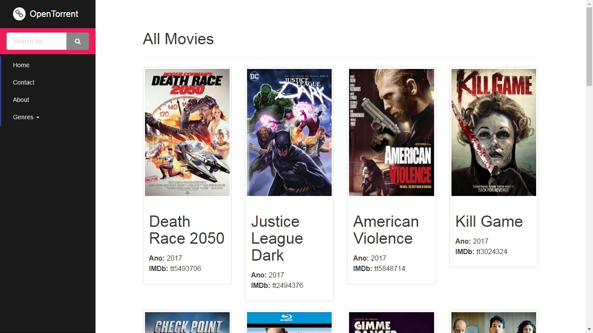
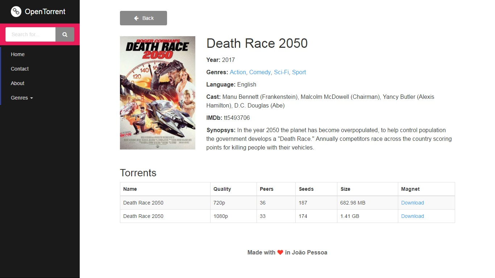
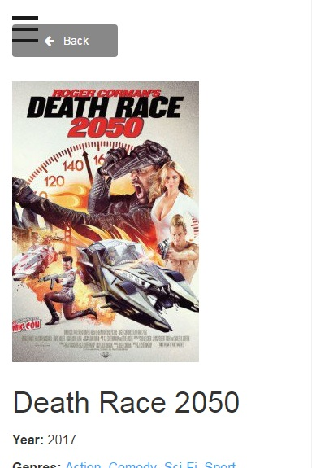
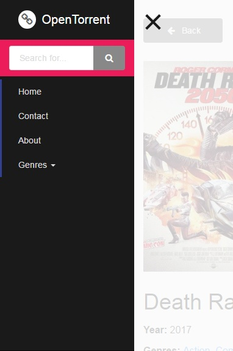

# OpenTorrent

Projeto de conclusão de disciplina de Linguagens de Script do IFPB - Campus João Pessoa.

DEMO: [clique aqui](https://matthtavares.github.io/ls).

## Descrição

Site de pesquisa e download de filmes através de torrent. A aplicação utiliza a API do [YTS](https://yts.ag/api) para consumo dos dados.

## Objetivo

Este projeto tem como objetivo a utilização dos conhecimentos adquiridos em sala, desenvolvendo uma aplicação utilizando HTML e CSS, para prover uma interface, e JavaScript, para dinamismo e melhor aproveitamento das API's que compõe a aplicação final.

## Inspiração

> Search and Browse YIFY Movies Torrent Downloads - YTS

## Protótipos

> Listing movies - Desktop

> Movie Details - Desktop

> Movie details - Mobile

> Movie details (Menu Open) - Mobile

## Recursos da API

### Listagem de Filmes

**Endpoint:**
> https://yts.ag/api/v2/list_movies.json

**Parâmentros:**

| Parâmetro | Obrigatório | Tipo | Default | Descrição |
|:---------------:|-------------|------------------------------------------------------------------------------------|------------|-----------------------------------------------------------------------------------------------------------|
| limit | N | Integer [1 - 50] | 20 | Limite de resultados por página. |
| page | N | Integer (Unsigned) | 1 | Utilizado para exibir a próxima página de resultados, ex limit=15 e page=2 exibirá os filmes entre 15-30. |
| quality | N | String (720p, 1080p, 3D) | All | Filtrar por uma determinada qualidade. |
| minimum_rating | N | Integer [0 - 9] | 0 | Filtrar por uma pontuação mínima no IMDb. |
| query_term | N | String | 0 | Procurar filmes, combinando por: Movie Title/IMDb Code, Actor Name/IMDb Code, Director Name/IMDb Code |
| genre | N | String | All | Filtrar por determinado gênero. Lista completa em [aqui](http://www.imdb.com/genre/). |
| sort_by | N | String (title, year, rating, peers, seeds, download_count, like_count, date_added) | date_added | Ordena os resultados pelo valor escolhido. |
| order_by | N | String (desc, asc) | desc | Ordena os resultados pela ordem escolhida. |
| with_rt_ratings | N | Boolean | false | Retorna a lista com a pontuação do Rotten Tomatoes. |

### Detalhes do Filme

**Endpoint:**
> https://yts.ag/api/v2/movie_details.json

**Parâmetros:**

| Parâmetro | Obrigatório | Tipo | Default | Descrição |
|:-----------:|-------------|--------------------|---------|--------------------------------------------------------|
| movie_id | S | Integer (Unsigned) | null | ID do filme. |
| with_images | N | Boolean | false | Quando `true`, retorna URL de imagens do filme. |
| with_cast | N | Boolean | false | Quando `true`, retorna lista do elenco, se disponível. |
